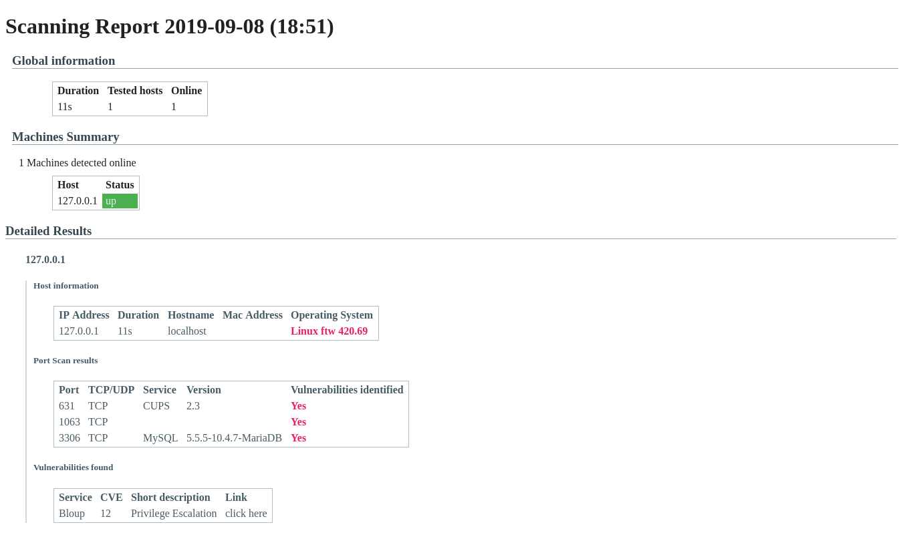

# port-eye

[](https://travis-ci.org/aHugues/port-eye)
[](https://codecov.io/gh/aHugues/port-eye)
[](https://github.com/psf/black)
[](https://opensource.org/licenses/MIT)

Simple CLI wrapper around nmap to perform port scanning in Python

**Note:** This software is indended for legitimate use only.

## Features

- Scanning of IPV4, IPV6 hosts and CIDR blocks.
- Parsing of hosts from input JSON file.
- Automated generation of reports in HTML format.
- Parallel scanning for increased performance.
- Optional Docker-based execution.

Example command:
```bash
$ port-eye -h4 127.0.0.1 -o report.html
```

Output html file example: 



## Installation

This application is compatible with Python 2.7 and Python 3.5+.

### Docker installation

If you have Docker installed, you can pull the image from Docker-Hub:

```bash
docker pull ahugues/port-eye
````

You can also build the image by cloning the repository and running: 

```bash
docker build -t port-eye .
```


### Prerequisites

You need to install `nmap` on your machine for the application to work (unless you choose the Docker install.)

Example on Ubuntu: 

```bash
sudo apt update
sudo apt install nmap
```

Example on Arch

```bash
sudo pacman -S nmap
``` 

Example on Mac with Homebrew

```bash
brew install nmap
```

### Install with pypi

If you have Python 2.7 or 3.5+ installed, you can install `port-eye` from PyPI:

```bash
pip install port-eye
```

or locally by clonning the repository and running:

```bash
pip install .
```


## Usage

### General notes

`port-eye` exposes a command line executable named `port-eye`

When run without any option, `port-eye` will simply display the help message.

Input hosts can be inputed from the CLI with options like `-h4` or `-h6` and `-c` and via an input file in JSON format. All the 
results are taken into account at the same time, so both options can be combines. 
> **Known limitation:** Currently, only input format JSON is supported. More format will be added soon.

If using Docker, and assuming you are working in a certain directory, you can run a `port-eye` container using:

```bash
docker run -v "$(pwd)":/files port-eye <options>
```

Or if built locally

```bash
docker run -v "$(pwd)":/files port-eye <options>
```

### CLI reference

```
Usage: port-eye [OPTIONS]

  Run the main application from arguments provided in the CLI.

Options:
  -h4, --ipv4 TEXT                IPV4 address of host to check
  -h6, --ipv6 TEXT                IPV6 address of host to check
  -c, --cidr TEXT                 CIDR block of hosts to check
  -f, --file PATH                 File containing the hosts to check
  -l, --logging [debug|info|warning|error]
                                  Select logging level in the terminal
  -m, --mock                      Use mock API instead of really running nmap
  -o, --output PATH               Output HTML file into which the results must
                                  be stored  [required]
  --help                          Show this message and exit.
```

## Contributing

Contributions are closed at the moment.

## License

MIT
